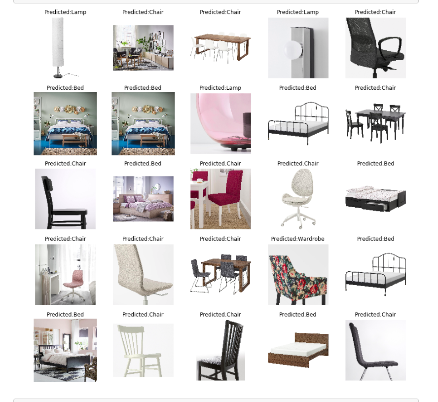

# Furniture Classification using Deep Learning

This is a project of classification of furniture - bed, chair, lamp, wardrobe from the given image. The codes are based on implementation of ResNet50 on Python 3, Keras and TensorFlow using Transfer Learning. The model generates a class label from 4 classes - bed, chair, lamp and wardrobe.

The code and examples can be found in [furniture_detection.ipynb](furniture_detection.ipynb).

# Examples

# Data Preprocessing

* There are 4 classes – Bed, Chair, Lamp & Wardrobe.
* Every class contains approx. 500 images.

# train_val_test.py
* Splits the dataset into 80% train, 10% validation & 10% test dataset.

# urls.py
* Scrapes image URLs from the IKEA website using beautifulsoup library.
* It generates "urls.txt" , which contains URLs of all the images for one class.

# download_images.py
* Downloads all the images using links in "urls.txt" .
* I manually removed a few unrelated images for each class.

# Model
* I have used Transfer Learning - pre-trained weights of ImageNet on ResNet50 Conv-net.
* ImageNet already includes similar classes, hence the weights can be utilized to quickly achieve good accuracy in this specific problem.
* I have used Stochastic Gradient Descent Optimizer with learning rate as 0.01, learning rate decay as 1e-6, momentum as 0.9 and applied Nesterov momentum as well.
* Keras ImageDataGenerator() generates real-time batches of tensor image data. The data will be looped over in batches. It is useful with large dataset to source, pre-process (resize, color conversion, image augmentation, batch normalize) & supply resulting images in batches to Keras modeling components, namely fit_generator() & predict_generator() or fit() & predict() for small dataset. It also helps save RAM usage by not loading all the images at once.
* Keras >> ImageDataGenerator >> flow_from_directory takes in 'classes' list for mapping it to Label indices otherwise treats sub-folders specified classes in alphabetical order, i.e., Bed is 0 & Chair is 1.
* I have trained the model on Google Colab’s Tesla K80 GPU for 10 epochs, where I achieved 93% accuracy on the validation dataset.

# Observations
* Confusion Matrix represents that we have achieved 93% accuracy on the test dataset.
* Moreover, it is evident that classes - bed & wardrobe have been classified perfectly.
* Class Lamp is having the most number of errors in classification, 6 out of 50 lamp images are classified as chair, 5 as wardrobe & 1 as bed.
* For the class chair, only 1 image has been wrongly classified as bed.
* The model has some problems predicting some images of chairs and lamps because both of these classes may contain other objects also, the model gets confused in such cases.
